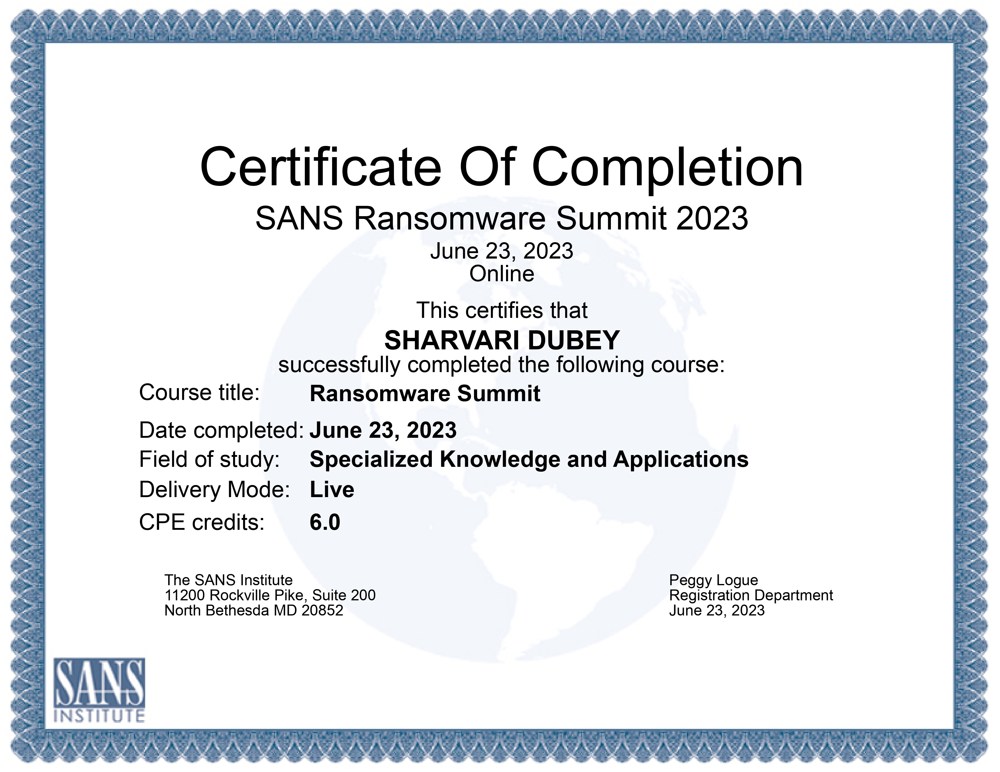

# 🎓 SANS Ransomware Summit 2023 – Webinar Summary

As part of my learning journey during the Tutelr internship, I attended the **SANS Ransomware Summit 2023** on June 23, 2023. It was a live virtual summit that brought together experts, researchers, and practitioners to share deep insights into ransomware threats and defense strategies.

---

## 🧠 Key Takeaways

- Ransomware actors are now focusing more on **data exfiltration** and **extortion** over simple encryption.
- Importance of **incident response planning** and **regular tabletop exercises**.
- Insights into **real-world ransomware case studies** from security professionals.
- Learned about the role of **initial access brokers**, phishing, and misconfigurations in ransomware deployment.

---

## 🎯 Why It Mattered

This summit helped me:
- Understand how attackers think and operate in ransomware campaigns.
- See how organizations structure their **technical and executive responses**.
- Explore tools and frameworks like MITRE ATT&CK for ransomware mapping.
- Connect my red teaming and DFIR tasks during the internship to real-world threats.

---

## 🖼 Certificate

**CPE Credits Earned:** 6.0  
**Mode:** Live (Online)  
**Issued By:** SANS Institute

---

> 🧩 This was a key learning milestone during my internship and reinforced my interest in red teaming and incident response.
